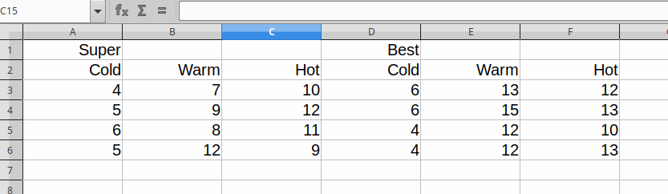

## Packages

```{r}
library(tidyverse)
```

## Introduction

A friend tells you that they are trying to find out which combination of detergent and temperature gets the most dirt off their laundry. They send you a spreadsheet that looks like this:




The first row is the name of the detergent (only named once), and the second row is the washing temperature. Below that is the amount of dirt removed from each of four loads of laundry washed under those conditions. (You know that your friend knows *something* about statistics and would have been careful to randomize loads of laundry to treatments.)

This is not going to be very helpful to you because it has *two* header rows. Fortunately [Alison Hill](https://alison.rbind.io/post/2018-02-23-read-multiple-header-rows/) has a blog post on almost this thing, which we can steal. In hers, the first row was variable names and the second was variable descriptions (which she used to make a data dictionary). Here, though, the column names need to be made out of bits of *both* rows.

## Making column names

The strategy is the same as Alison used (so I'm claiming very little originality here): read the header lines and make column names out of them, then read the rest of the data with the column names that we made.

Your friend supplied you with a `.csv` file (they do have *some* training, after all):

```{r}
my_file <- "https://raw.githubusercontent.com/nxskok/nxskok.github.io/master/static/detergent.csv"
headers <- read_csv(my_file, col_names=F, n_max=2)
headers
```

Couple of things here: we want `read_csv` to supply some dummy column names, and we want to read only two rows.

To use this, we want to construct some column names, but to do this it will be much easier if we have six rows and a few columns. For me, this is an everything-looks-like-a-nail moment, and I reach for `gather`, and then stop myself just in time to use `pivot_longer` instead. To keep things straight, I'm going to make a new column first so that I know what is what, and then use the default column names `name` and `value` in `pivot_longer` until I figure out what I'm doing:

```{r}
headers %>% mutate(what=c("detergent", "temperature")) %>% 
  pivot_longer(-what)
```

So now it looks as if I want to `pivot_wider` that column `what`, getting the values from `value`. (At this point, I feel a nagging doubt that I can do this with one `pivot_longer`, but anyway):^[I don't actually think I can here. I was thinking of `.value`, but that is used when the names of the columns that I'm making longer contain the names of new columns in them.]

```{r}
headers %>% mutate(what=c("detergent", "temperature")) %>% 
  pivot_longer(-what) %>% 
  pivot_wider(names_from=what, values_from=value) -> d1
d1
```

Much better. Next, I need to fill those missing values in `detergent`, and then I glue those two things together to make my column names:

```{r}
d1 %>% fill(detergent) %>% 
  mutate(mycol=str_c(detergent, temperature, sep="_")) -> d2
d2
```

and then grab my desired column names as a vector:

```{r}
d2 %>% pull(mycol) -> my_col_names
```

## Constructing the data frame with the rest of the data

Now we need to read the actual data, which means skipping the first *two* rows, and while doing so, use the column names we made as column names for the data frame (Alison's idea again):

```{r}
laundry <- read_csv(my_file, skip=2, col_names=my_col_names)
laundry
```

Looking good so far.

We need to make this longer to do anything useful with it. Each column name encodes two things: a detergent name and a temperature, and this can be made longer in one shot by using *two* things in `names_to` in `pivot_longer`. This means I also have to say what those two names are separated by (which I forgot the first time, but the error message was helpful):

```{r}
laundry %>% 
  pivot_longer(everything(), names_to=c("detergent", "temperature"), 
               names_sep="_", 
               values_to="dirt_removed") -> laundry_tidy
laundry_tidy
```

Success.

## A plot

There are four observations per combination of detergent and temperature, so that devotees of ANOVA among you will know that we can test for a significant interaction effect between detergent and temperature on the amount of dirt removed. (That is to say, the effect of temperature on dirt removed might be different for each detergent, and we have enough data to see whether that is indeed the case "for all laundry loads".)

To see whether this is likely, we can make an *interaction plot*: plot the mean dirt removed for each temperature, separately for each detergent, and then join the results for each temperature by lines (coloured by detergent). This can be done by first making a data frame of means using `group_by` and `summarize`, or like this:

```{r}
ggplot(laundry_tidy, aes(x=fct_inorder(temperature), y=dirt_removed, colour=detergent, group=detergent)) + 
  stat_summary(fun.y=mean, geom="point") +
  stat_summary(fun.y=mean, geom="line")
```

Code-wise, the last two lines are a kind of funky `geom_point` and `geom_line`, except that instead of plotting the actual amounts of dirt removed, we plot the *mean* dirt removed each time. (The `fct_inorder` plots the temperatures in the sensible order that they appear in the data, rather than alphabetical order.)

Statistically, if the two traces are more or less parallel, the two factors detergent and temperature act independently on the amount of dirt removed. But that is not the case here: a warm temperature is the best for Best detergent, while a hot temperature is best for Super detergent.^[There are always two ways to express an interaction effect. The other one here is that the two detergents are pretty similar except at warm water temperatures, where Best is a lot better.]


## As in actual website 

So I lied to you (for the purpose of telling a story, but I hope a useful one).

Here's how the data [were actually laid out](http://statweb.stanford.edu/~susan/courses/s141/exanova.pdf):

```
Detergent    Cold         Warm          Hot
Super     4,5,6,5     7,9,8,12   10,12,11,9
Best      6,6,4,4  13,15,12,12  12,13,10,13
```

Let's see whether we can tell a different story by getting these data tidy. (I added the word Detergent to the top left cell to make our lives slightly easier.)

First, this is column-aligned data, so we need `read_table`:

```{r}
my_file="https://raw.githubusercontent.com/nxskok/nxskok.github.io/master/static/laundry.txt"
laundry_2 <- read_table(my_file, col_types=cols(
  Cold=col_character(),
  Warm=col_character(),
  Hot=col_character()
))
laundry_2
```

My first go at this turned out to treat the comma as a thousands separator (which was then dropped), so the top left cell got read as the number 4565. This use of `col_types` forces the columns to be text, so they get left alone. 

So now, a standard `pivot_longer` to begin:

```{r}
laundry_2 %>% pivot_longer(-Detergent, names_to="Temperature", values_to="Dirt_removed")
```

We have several values for dirt removed, separated by commas. We could use `separate` to create four new columns and pivot *them* longer as well. But there is a better way:

```{r}
laundry_2 %>% pivot_longer(-Detergent, names_to="Temperature", values_to="Dirt_removed") %>% 
  separate_rows(Dirt_removed, convert=T) 
```

This brings us back to where we were before. A couple of notes about `separate_rows`:

- it puts each separated value on a new row, and so is a combined `separate` and `pivot_longer`.
- the default separator between values is everything non-alphanumeric except for a dot. That includes a comma, so we don't have to do anything special.
- `convert=T` says to turn the separated values into whatever they look like (here numbers).

From here, we can proceed as before with plots, ANOVA or whatever.


## References

- [Data from here](http://statweb.stanford.edu/~susan/courses/s141/exanova.pdf)
- [Alison Hill's blog post](https://alison.rbind.io/post/2018-02-23-read-multiple-header-rows/)
- [Introduction to `readr`](https://readr.tidyverse.org/articles/readr.html)
- [Documentation for `separate_rows`](https://www.rdocumentation.org/packages/tidyr/versions/0.8.3/topics/separate_rows)
